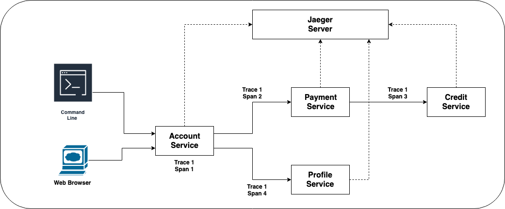
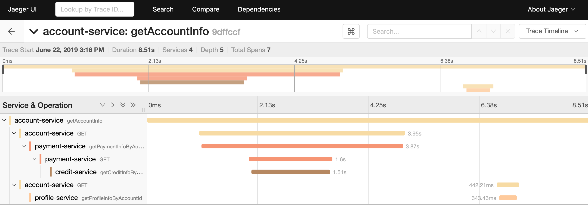
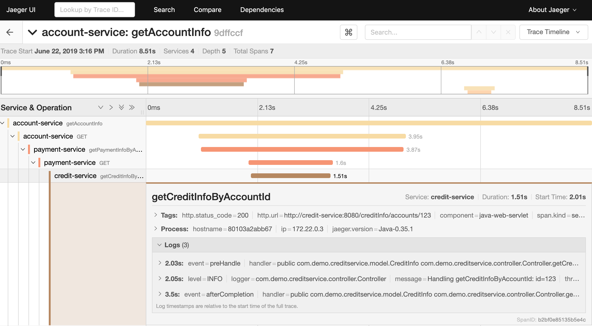
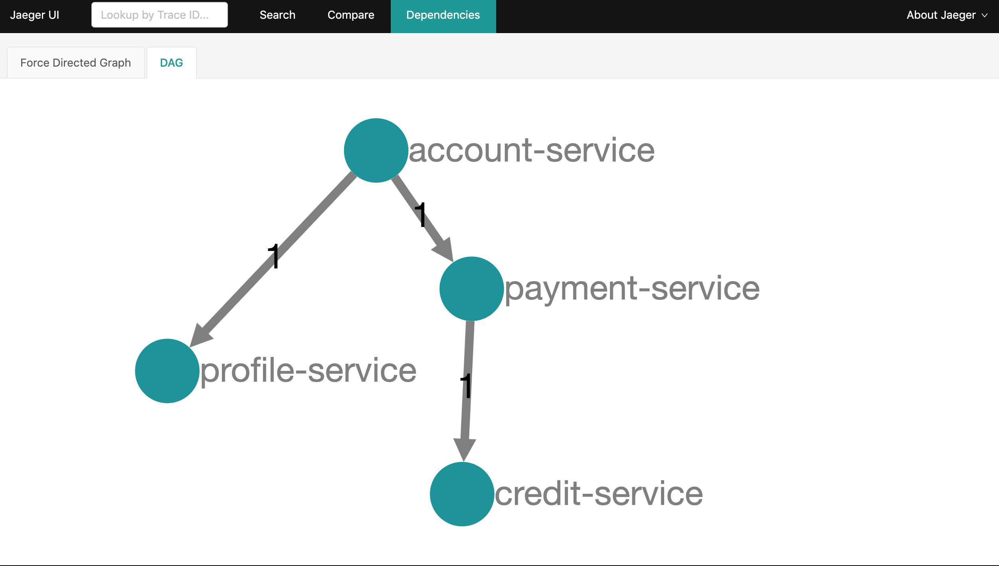

# Distributed Tracing For Spring Boot Applications Using Jaeger

## By Sandeep Kumar

The goal of this repository is to illustrate how to leverage Jaeger as the distributed tracing solution for Spring Boot applications.

With little configuration, trace information is passed between services and reported to Jaeger server and you can see the trace information in the Jaeger UI.

## Example

In this repo, ideas and solutions are illustrated by applying them to a contrived example. There is not much real business related functionality implemented and the idea of the example is to have multiple services working together to loosely reflect a real world scenario.

There are 4 different services in this example. `Account Service` is the main service with which client (browser) interacts. `Account Service` in turns calls `Payment Service` and `Profile Service` for the relevant information for the requested account id. `Payment Service`, upon receiving the request, also calls `Credit Service` for the credit information. A random delay is added to each service's processing to simulate the time used in processing the business logic.




## Jaeger

[Jaeger](https://github.com/jaegertracing/jaeger) is a distributed system provided by Uber. 

>It is used for monitoring and troubleshooting microservices-based distributed systems, including:
>* Distributed context propagation
>* Distributed transaction monitoring
>* Root cause analysis
>* Service dependency analysis
>* Performance / latency optimization

It is [OpenTracing]((https://opentracing.io/)) compatible and provides instrumentation libraries in major programming languages.


## Spring Boot Configuration

Spring Boot/Cloud integration is available via [java-spring-cloud](https://github.com/opentracing-contrib/java-spring-cloud) project. It is as simple as adding necessary dependency to the project.

`pom.xml` configruation

```
<dependency>
    <groupId>io.opentracing.contrib</groupId>
    <artifactId>opentracing-spring-jaeger-cloud-starter</artifactId>
</dependency>
```

`application.yaml` configuration
```
opentracing:
  spring:
    cloud:
      log:
        enabled: true
  jaeger:
    enabled: true
    #    probabilistic-sampler:
    #      sampling-rate: 1.0
    log-spans: true
    udp-sender:
      host: localhost
      port: 6831
    # demonstration purpose only
    const-sampler:
      decision: true
    service-name: account-service
```


## Building The Services

Inside the repository, each sub-directoy contains the source code for each service. Execute the maven command in each sub-directory to build each service

```
mvn clean verify
```

Alternatively, a `Dockerfile` is provided for each service. Execute the following command to build and containerize the service.

```
docker-compose -f docker-compose.yaml build
```

## Running The Services

First of all, stand up `Jaeger` server

```
docker-compose -f docker-compose-infra.yaml up -d
```

The, run the services

```
docker-compose -f docker-compose.yaml up -d
```

## Generate Traces

```
curl http://localhost:8080/accounts/123
```

`123` is the account id, any number will do.


## Oberserve the Trace

Jaeger UI is available at `http://localhost:16686`


From the left panel, select `account-service` from the `Services` dropdown list and click the `Find Traces` button.

All available traces will show up on the main panel. Click any trace to dive into details.



Click a span will take you to the detail view about that particular span



Jaeger will also analyze the trace and provide the dependency graph.


